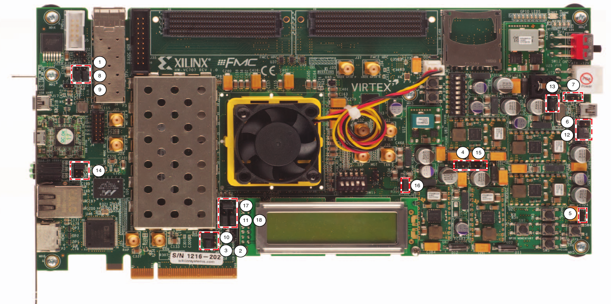

# xlnx-vc707-templates

> **Xilinx Virtex-7 FPGA Board, VC707 Evaluation Kit, Reference Design Projects**

## Product Description
The Virtex®-7 FPGA VC707 Evaluation Kit is a full-featured, highly-flexible, high-speed serial base platform using the Virtex-7 XC7VX485T-2FFG1761C and includes basic components of hardware, design tools, IP, and pre-verified reference designs for system designs that demand high-performance, serial connectivity and advanced memory interfacing. The included pre-verified reference designs and industry-standard FPGA Mezzanine Connectors (FMC) allow scaling and customization with daughter cards.

## Key Features & Benefits
* 40Gb/s Connectivity platform for high-bandwidth and high-performance applications using Virtex-7 VX485T FPGAs
* Hardware, design tools, IP, and pre-verified reference designs
* Supports embedded processing with MicroBlaze, soft 32bit RISC
* Enabling serial connectivity with PCIe Gen2x8, SFP+ and SMA Pairs, UART, IIC
* Advanced memory interface with 1GB DDR3 SODIM Memory up to 800MHz / 1600Mbps
* Develop networking applications with 10-100-1000 Mbps Ethernet (GMII, RGMII and SGMII)
* Expand I/O with the FPGA Mezzanine Card (FMC) interface

